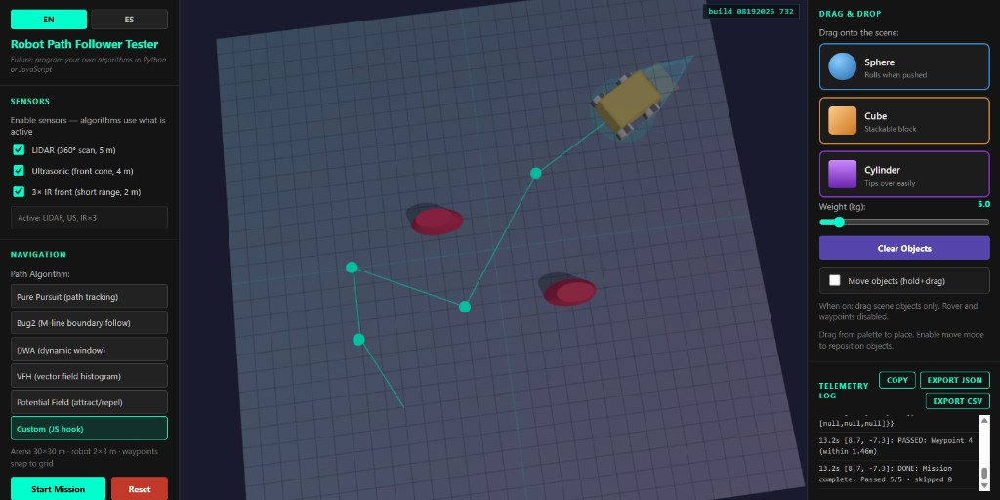

# 🤖 Robot Path Follower Tester

EN / ES · Vite + Three.js



> **Many times we need to fast-simulate follow algorithms on a 4-wheel robot — that's why we made this app.**
>
> **Muchas veces necesitamos simular rápido algoritmos de seguimiento en un robot de 4 ruedas — por eso hicimos esta app.**

Drop waypoints, pick an algorithm, watch a **4-wheel robot** navigate in 3D — no ROS install, no Gazebo wait, no hardware required. Just open the browser and test your idea in seconds.

Coloca waypoints, elige un algoritmo y mira un **robot de 4 ruedas** navegar en 3D — sin instalar ROS, sin esperar Gazebo, sin hardware. Abre el navegador y prueba tu idea en segundos.

---

## 🥑 Why this exists / Por qué existe

| Problem | This app |
|---------|----------|
| Path-following ideas are slow to validate on real hardware | Instant 3D sandbox in the browser |
| ROS/Gazebo setup takes forever for a quick test | `npm install && npm run dev` — done |
| You want to compare Pure Pursuit, Bug2, DWA, VFH, and Potential Field | Switch algorithms in one click |
| Teaching or prototyping a 4-wheel differential-drive bot | Visual telemetry + collision log |

**Future / Futuro:** plug in your own algorithms in **Python** or **JavaScript**.

---

## ⚡ Quick start

```bash
git clone <repo-url>
cd robot-path-planning-sim
npm install
npm run dev
```

Open **http://localhost:5173/** · toggle **English / Español** in the UI.

---

## 🎮 How to use

**Layout:** left panel = settings · **center** = 3D robot scene · **right** = drag & drop objects + telemetry log.

1. **Click the center scene** → set waypoints (🟢 start · 🟡 middle · 🔴 end)
2. **Pick an algorithm** → Pure Pursuit · Bug2 · DWA · VFH · Potential Field · Custom
3. **Start Exploration** → watch the robot follow the path and dodge obstacles
4. **Drag objects** from the right panel onto the scene → stack boxes/spheres/cylinders; the robot pushes them on contact

---

## 🛞 Built-in algorithms

| Algorithm | What it does |
|-----------|--------------|
| **Pure Pursuit** (`pure_pursuit`) | Tracks the waypoint path using a lookahead target |
| **Bug2** (`bug2`) | Follows the M-line to the goal and traces obstacles when blocked |
| **DWA** (`dwa`) | Scores short motion candidates and picks a safe forward command |
| **VFH** (`vfh`) | Builds a local steering choice from obstacle sectors |
| **Potential Field** (`potential_field`) | Combines attraction to the target with repulsion from obstacles |
| **Custom** (`custom`) | JS pad: copy the robot API, paste a `loop()` that sets `v` and `omega` |

---

## 🧱 Stack

- **Three.js** — 3D scene, robot mesh, sensors, radar arcs
- **cannon-es** — physics props the robot can push
- **Vite** — fast dev server
- **i18n** — English + Spanish UI

**Physics note / Nota de física:** `cannon-es` is used for visual props and kinematic rover motion (`applyMotion` + kinematic body). This is not a validated differential-drive dynamics simulator.

**Nota de física / Physics note:** `cannon-es` se usa para objetos visuales y movimiento cinemático del rover (`applyMotion` + cuerpo cinemático). No es un simulador validado de dinámica diferencial.

---

## 📂 Project layout

```
index.html              # 3-column UI + Custom JS pad
main.js                 # scene, rover, mission, telemetry, Custom checker
nav.js                  # sensors + algorithms
style.css               # layout
scripts/smoke_sim.mjs   # smoke test
notes/                  # public wiki (how-to + API)
```

Wiki: **[notes/Home.md](notes/Home.md)** — how to use, architecture, `main.js` / `nav.js` API, Custom JS.

---

## 🚀 Roadmap

- [x] Custom JS pad (copy setup → AI → check/save loop)
- [x] Export telemetry as JSON/CSV
- [x] GitHub README screenshot
- [ ] GitHub Pages live demo

---

## 📜 License

MIT — use it, break it, improve it.

Made with 🥑
