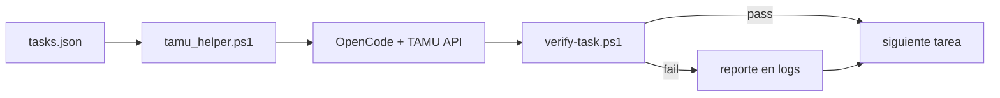

# Orquestación TAMU AI

TAMU OpenCode **ejecuta** tareas de código. Un **agente verificador** (local, misma sesión) **comprueba** con criterios objetivos. Si TAMU falla, se **reporta** — no se sustituye su trabajo salvo que el usuario lo pida.

Copiado de `../TAMU AI/tamu-helper-cli/` + el módulo de orquestación de `../comfyUI/tamu-helper-cli/`.

**Guía para dar órdenes (chat, prompt único, cola, ejemplos):** [TAMU_AI_ORDENES.md](TAMU_AI_ORDENES.md)

---

## Cómo correr

```bat
run-tamu-orchestrate.bat
```

O manual:

```powershell
cd tamu-helper-cli
.\orchestrate.ps1
```

Reanudar desde una tarea:

```powershell
.\orchestrate.ps1 -FromTask smoke-script
```

Dry-run (sin llamar API):

```powershell
.\orchestrate.ps1 -DryRun
```

Verificar una tarea a mano:

```powershell
.\verify-task.ps1 -TaskId smoke-script
```

Abrir OpenCode en este repo:

```powershell
cd tamu-helper-cli
.\tamu_helper.ps1 -ProjectPath ".."
```

---

## Tareas en cola (`tamu-helper-cli/tasks.json`)

| ID | Qué debe entregar TAMU | Verificación |
|----|------------------------|--------------|
| `smoke-script` | `scripts/smoke_sim.mjs` | archivo existe + `node` exit 0 |
| `telemetry-export` | botones JSON/CSV en UI | ids + nombres de archivo en `main.js` |
| `readme-algos` | README con los 5 algoritmos vivos | Pure Pursuit, Bug2, DWA, VFH, Potential Field |
| `custom-algo-stub` | `algorithms/custom.js` + botón UI | import en `nav.js` + `data-algo="custom"` |

Reporte de corrida: `tamu-helper-cli/logs/orchestration-report.json`

---

## Flujo secuencial



1. Lee cola en `tasks.json`.
2. Por cada tarea: prompt a OpenCode vía `tamu_helper.ps1` (timeout 15 min).
3. Ejecuta `verify-task.ps1` con criterios fijos.
4. Escribe `logs/orchestration-report.json`.
5. Si verificación falla → **reportar**, no parchear el código del producto.

---

## Archivos

| Ruta | Rol |
|------|-----|
| `tamu-helper-cli/tamu_helper.ps1` | Bootstrap OpenCode + TAMU API |
| `tamu-helper-cli/orchestrate.ps1` | Orquestador secuencial |
| `tamu-helper-cli/verify-task.ps1` | Chequeos objetivos post-TAMU |
| `tamu-helper-cli/tasks.json` | Cola de prompts + IDs |
| `tamu-helper-cli/.env` | `TAMU_API_KEY` — **no subir a GitHub** |
| `tamu-helper-cli/logs/` | Logs de corrida — **no subir** |

---

## Cuota TAMU

~$10/día por usuario. Si aparece `Budget Exceeded`, esperar al reset (~18:00 Central) antes de reintentar.
